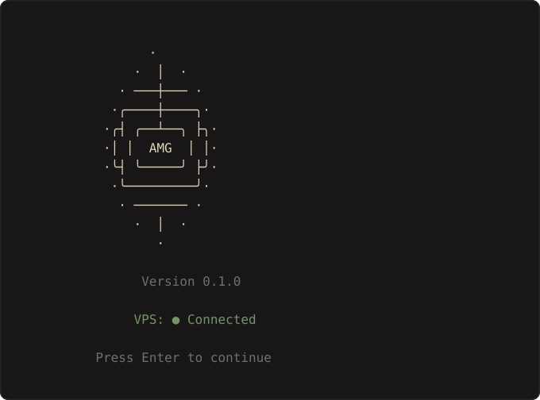
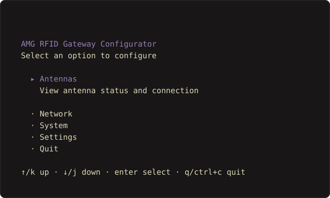
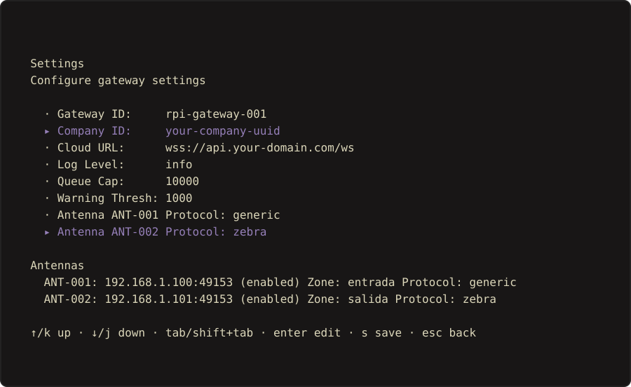

# AMG-RFID Gateway

Edge Gateway for Raspberry Pi that connects RFID antennas to the cloud backend.

## Overview

This gateway acts as a bridge between RFID antennas (using raw TCP protocol) and the AMG-RFID cloud backend. It provides:

- **Splash Screen**: ASCII art logo with version display and VPS connection status on startup
- **Auto-Detect Configuration**: Binary automatically finds config.yaml in standard locations
- **TUI Configurator**: Terminal-based configuration with full settings editing
- **Local Caching**: SQLite-based buffering for offline operation
- **Automatic Sync**: Batches readings to the cloud via secure WebSocket/HTTP
- **Multi-Antenna Support**: Connect multiple antennas simultaneously
- **Per-Antenna Protocol Config**: Configure each antenna protocol independently (`generic` by default)
- **Web UI**: Built-in web interface for manual tag confirmation
- **OTA Updates**: Automatic over-the-air updates from GitHub releases
- **Health Monitoring**: Built-in health checks and Prometheus metrics

## Architecture

```
┌─────────────────────────────────────────────────────────────┐
│                    Raspberry Pi (Gateway)                    │
│  ┌──────────────┐  ┌──────────────┐  ┌──────────────────┐   │
│  │  Antenna 1   │  │  Antenna 2   │  │   TUI Config     │   │
│  │  (Raw TCP)   │  │  (Raw TCP)   │  │   (Bubbletea)    │   │
│  └──────┬───────┘  └──────┬───────┘  └────────┬─────────┘   │
│         │                 │                    │             │
│         └─────────────────┼────────────────────┘             │
│                           ▼                                  │
│                  ┌────────────────┐                          │
│                  │  SQLite Cache  │                          │
│                  │  (local store) │                          │
│                  └───────┬────────┘                          │
│                          │                                   │
│                          ▼                                   │
│                  ┌────────────────┐                          │
│                  │  Sync Engine   │                          │
│                  │  (batch+retry) │                          │
│                  └───────┬────────┘                          │
│                          │                                   │
│                          ▼                                   │
│                  ┌────────────────┐                          │
│                  │    Web UI      │                          │
│                  │  (port 9090)   │                          │
│                  └────────────────┘                          │
│                                                              │
└──────────────────────────┬───────────────────────────────────┘
                           │ HTTPS/WSS
                           ▼
┌─────────────────────────────────────────────────────────────┐
│                    Cloud Backend                             │
│              api.amg-rfid.com/api/v1/rfid/sync              │
└─────────────────────────────────────────────────────────────┘
```

## Features

### Core Features

| Feature | Description |
|---------|-------------|
| **Splash Screen** | ASCII art logo with RFID waves, version, and VPS connection status |
| **Auto-Detect Config** | Binary searches config automatically in standard locations |
| **SQLite Cache** | Thread-safe local storage with WAL mode for durability |
| **Buffered Writes** | 1000-capacity channel with background flush every 1s |
| **Batch Sync** | Sends up to 100 readings per request to minimize API calls |
| **Auto-Retry** | Exponential backoff (max 5 retries) for failed syncs |
| **Reconnect Logic** | Automatic antenna reconnection with configurable backoff |
| **Multi-Antenna** | Supports multiple antennas via goroutines |
| **Protocol Config** | Per-antenna protocol selection with backward-compatible `generic` default |
| **Web UI** | Built-in verification interface on port 9090 |
| **Settings TUI** | Full configuration editing without leaving the TUI |

### TUI Configurator

Interactive terminal interface using Bubbletea with splash screen and multiple screens:

```bash
# Run TUI configurator (auto-detects config)
./gateway-tui

# Or run directly with auto-detected config
./gateway-tui
```

**Flow:**
1. **Splash Screen** (2 seconds): ASCII logo + version + VPS connection status
2. **Main Menu**: Navigate to Antennas, Network, System, Settings, or Quit

#### Splash Screen


#### Main Menu


#### Settings


**Screens:**
- **Antennas**: View all connected antennas, their status, reading counts, and last tag EPC/RSSI
- **Network**: Connection state to cloud backend and VPS API
- **System**: Gateway ID, company ID, version, uptime, cache size, sync status
- **Settings**: Full TUI-based configuration editor with field validation
  - Gateway ID, Company ID, Cloud URL, Log Level
  - Queue Cap, Warning Threshold
  - View antenna configurations and edit each antenna protocol
  - Save changes without restarting

**Navigation:**
- Arrow keys or `j/k` to navigate
- Enter to select/edit
- `q` or `Ctrl+C` to quit
- `Esc` to go back

### OTA Updates

Automatic updates from GitHub releases with Homebrew tap auto-update:

```bash
# Check for updates manually
./gateway --check-update

# Update via Homebrew
brew upgrade amg-rfid-gateway

# Update via script
sudo ./scripts/update.sh
```

**Safety Features:**
- SHA256 checksum verification
- Automatic backup before update
- Health check after update
- Automatic rollback on failure
- Preserves config.yaml and data/

## Installation

### Homebrew (Recommended)

```bash
# Add the tap
brew tap AMG-Repo/tap

# Install
brew install amg-rfid-gateway

# Run with auto-detected config
gateway

# Or run TUI
gateway-tui

# As a service
brew services start amg-rfid-gateway
```

### Quick Install (Alternative)

```bash
# Download and run install script
curl -sSL https://raw.githubusercontent.com/amg-rfid/amg-rfid-gateway/main/scripts/install.sh | sudo bash

# Or with wget
wget -qO- https://raw.githubusercontent.com/amg-rfid/amg-rfid-gateway/main/scripts/install.sh | sudo bash
```

### Manual Installation

```bash
# 1. Create user and directories
sudo useradd -r -s /bin/false gateway
sudo mkdir -p /opt/amg-rfid-gateway/data
sudo chown -R gateway:gateway /opt/amg-rfid-gateway

# 2. Download binary
wget https://github.com/amg-rfid/amg-rfid-gateway/releases/latest/download/gateway-linux-arm64
sudo mv gateway-linux-arm64 /opt/amg-rfid-gateway/gateway
sudo chmod +x /opt/amg-rfid-gateway/gateway

# Also download TUI binary
wget https://github.com/amg-rfid/amg-rfid-gateway/releases/latest/download/gateway-tui-linux-arm64
sudo mv gateway-tui-linux-arm64 /opt/amg-rfid-gateway/gateway-tui
sudo chmod +x /opt/amg-rfid-gateway/gateway-tui

# 3. Create config
cp configs/config.example.yaml /opt/amg-rfid-gateway/config.yaml
# Edit config.yaml with your settings

# 4. Install systemd service
sudo cp scripts/systemd/gateway.service /etc/systemd/system/
sudo systemctl daemon-reload
sudo systemctl enable gateway
sudo systemctl start gateway
```

### Build from Source

```bash
# Requirements: Go 1.25+

# Clone repository
git clone https://github.com/amg-rfid/amg-rfid-gateway.git
cd amg-rfid-gateway

# Build for Raspberry Pi (ARM64)
make build-arm64

# Or build for ARMv7 (older Pi)
make build-arm

# Build TUI
make build-tui

# Build all binaries
make build-all
```

## Configuration

The gateway auto-detects configuration files in this order:

1. `$GATEWAY_CONFIG` environment variable
2. `./config.yaml` (current directory)
3. `$(brew --prefix)/etc/amg-rfid-gateway/config.yaml` (Homebrew)
4. `/etc/amg-rfid-gateway/config.yaml` (system)

This means `--config` flag is now optional:

```bash
# These all work the same if config is in a standard location
./gateway
./gateway --config /etc/amg-rfid-gateway/config.yaml
GATEWAY_CONFIG=/path/to/config.yaml ./gateway
```

### Complete Configuration Example

```yaml
# AMG RFID Gateway Configuration

# Gateway identification
gateway_id: "rpi-gateway-001"
company_id: "your-company-uuid"

# Cloud backend connection
cloud_url: "wss://api.your-domain.com/ws"
jwt_secret: "your-jwt-token-here"

# Synchronization settings
sync_interval: 30s
batch_size: 100
max_retries: 5

# Health check endpoint port
health_port: 8080

# Data storage path (SQLite database)
data_path: "/opt/amg-rfid-gateway/data"

# Antenna configurations
# Protocol field: "generic" is the supported default for current packet handling.
# "zebra" is accepted by configuration for future Zebra-specific handlers, but
# do not enable Zebra runtime deployments until protocol handler support is added.
# Zone field: "entrada" (entry), "salida" (exit), or "" (empty for auto-detect)
antennas:
  - id: "ANT-001"
    ip: "192.168.1.100"
    port: 49153
    enabled: true
    zone: "entrada"
    protocol: "generic"

  - id: "ANT-002"
    ip: "192.168.1.101"
    port: 49153
    enabled: true
    zone: "salida"
    protocol: "generic"

  # Zebra can be selected in config/TUI, but runtime parsing is intentionally
  # unsupported until a Zebra-specific protocol handler is implemented.
  # - id: "ANT-003"
  #   ip: "192.168.1.102"
  #   port: 5084
  #   enabled: false
  #   zone: ""
  #   protocol: "zebra"

# Permanent Listening Mode (REQ-A006)
# Controls how the gateway handles continuous antenna connections
listen_mode: "auto"                    # Options: "active", "passive", "auto"
heartbeat_interval: 3s                 # How often to send heartbeat pings
heartbeat_silence_threshold: 5s        # Silence threshold for connection health

# Adaptive Delay Configuration
# Fine-tune reading detection sensitivity based on tag activity
adaptive_delay_recent: 3s              # Delay after recent tag detection
adaptive_delay_recent_window: 2s       # Window for "recent" classification
adaptive_delay_stale: 1s               # Delay when no tags detected recently
adaptive_delay_stale_window: 10s       # Window for "stale" classification
adaptive_delay_auto_reading: 5s        # Auto-reading delay in auto mode

# Reconnection Configuration
reconnect_initial_backoff: 1s          # Initial retry backoff (doubles each attempt)
reconnect_max_backoff: 30s             # Maximum backoff between reconnection attempts
socket_path: "/tmp/amg-rfid-gateway.sock"  # Unix socket for TUI bridge

# Web UI Configuration (Local Verification Frontend)
web_enabled: true                      # Enable/disable the web UI
web_port: 9090                         # Port for the web server
web_listen_addr: "0.0.0.0"             # Bind address (0.0.0.0 = all interfaces)
vps_api_url: "https://api.your-domain.com"  # VPS API base URL for tool sync
sync_tools_interval: 1h                # How often to sync tools from VPS
confirmation_retry_interval: 30s       # Retry interval for pending confirmations

# Queue Size Limits (Pending Confirmations)
max_pending_confirmations: 10000       # Max pending confirmations (0 = unlimited)
pending_warning_threshold: 1000        # Warning threshold (0 = never warn)

# Logging
log_level: "info"                      # debug, info, warn, error

# Metrics configuration (optional)
metrics:
  enabled: true
  port: 9091
  path: "/metrics"

# OTA Update settings (optional)
updates:
  check_interval: "24h"
  auto_update: false
  channel: "stable"  # stable, beta
```

### Configuration Fields Reference

| Field | Type | Default | Description |
|-------|------|---------|-------------|
| `gateway_id` | string | required | Unique gateway identifier |
| `company_id` | string | required | Company UUID for authentication |
| `cloud_url` | string | required | WebSocket URL (wss://) for cloud sync |
| `jwt_secret` | string | required | Authentication token |
| `sync_interval` | duration | 30s | How often to sync to cloud |
| `batch_size` | int | 100 | Readings per sync request |
| `max_retries` | int | 5 | Max retry attempts for failed syncs |
| `health_port` | int | 8080 | HTTP port for health/metrics |
| `data_path` | string | ./data | SQLite database location |
| `listen_mode` | string | auto | Antenna listening mode (active/passive/auto) |
| `heartbeat_interval` | duration | 3s | Heartbeat ping interval |
| `heartbeat_silence_threshold` | duration | 5s | Connection health threshold |
| `adaptive_delay_*` | duration | varies | Fine-tune reading sensitivity |
| `reconnect_*` | duration | varies | Reconnection backoff settings |
| `web_enabled` | bool | true | Enable web UI |
| `web_port` | int | 9090 | Web UI port |
| `web_listen_addr` | string | 0.0.0.0 | Web UI bind address |
| `vps_api_url` | string | required | VPS REST API base URL |
| `sync_tools_interval` | duration | 1h | Tool sync frequency |
| `confirmation_retry_interval` | duration | 30s | Pending confirmation retry |
| `max_pending_confirmations` | int | 10000 | Queue size limit (0=unlimited) |
| `pending_warning_threshold` | int | 1000 | Warning threshold (0=never) |
| `log_level` | string | info | Logging verbosity |

### Antenna Protocols

Each antenna supports a `protocol` field:

| Protocol | Status | Use when |
|----------|--------|----------|
| `generic` | Supported default | The antenna speaks the current generic RFID TCP packet format |
| `zebra` | Configurable, runtime unsupported | Preparing configuration for a future Zebra-specific handler |

Existing configs without `protocol` are treated as `generic`. Unsupported protocol values fail configuration validation so the gateway does not accidentally parse another reader type as generic.

## Usage

### Start Gateway

```bash
# With auto-detected config (recommended)
./gateway

# Or specify config explicitly
./gateway --config /opt/amg-rfid-gateway/config.yaml

# With verbose logging
./gateway --log-level debug

# As systemd service
sudo systemctl start gateway
sudo systemctl status gateway
```

### View Logs

```bash
# Via systemd
sudo journalctl -u gateway -f

# Or check log files
sudo tail -f /opt/amg-rfid-gateway/data/gateway.log
```

### TUI Configuration

```bash
# Launch TUI with splash screen and auto-detected config
./gateway-tui

# The TUI shows:
# 1. Splash screen (2s): Logo, version, VPS status
# 2. Main Menu: Navigate with arrow keys
#    - Antennas: View antenna status and readings
#    - Network: Cloud connection status
#    - System: Gateway metrics and sync info
#    - Settings: Edit configuration fields
#    - Quit: Exit the TUI

# Navigate with arrow keys
# Enter to select/edit
# 's' to save changes in Settings screen
# q or Ctrl+C to quit
# Esc to go back
```

### Health Check

```bash
# Check gateway health
curl http://localhost:8080/health

# Response:
# {
#   "status": "healthy",
#   "gateway_id": "gateway-001",
#   "antennas_connected": 2,
#   "cache_pending": 0,
#   "last_sync": "2024-01-15T10:30:00Z"
# }
```

### Prometheus Metrics

```bash
# Scrape metrics
curl http://localhost:8080/metrics

# Key metrics:
# gateway_readings_pending - Number of unsynced readings
# gateway_sync_success_total - Total successful syncs
# gateway_sync_failure_total - Total failed syncs
# gateway_uptime_seconds - Gateway uptime
# gateway_antennas_connected - Number of connected antennas
```

### Web UI

When `web_enabled: true`, access the web interface at:

```
http://gateway-ip:9090
```

Features:
- Manual tag confirmation interface
- Real-time reading display
- Tool verification status

## Testing

```bash
# Run all tests
make test

# Run with coverage
make test-coverage

# Run specific package tests
go test ./internal/cache/... -v
go test ./internal/sync/... -v
go test ./test/e2e/... -v

# E2E tests (require mock backend)
go test ./test/e2e/... -v --tags=e2e
```

## API Integration

The gateway communicates with the cloud backend using these endpoints:

| Endpoint | Method | Description |
|----------|--------|-------------|
| `/api/v1/rfid/sync` | POST | Send batch of readings |
| `/api/v1/rfid/pending` | GET | Get pending confirmations |
| `/api/v1/health/gateways` | GET | Health check |
| `/metrics` | GET | Prometheus metrics |
| `/health` | GET | Simple health status |

**Authentication:** JWT Bearer token with `gateway_id` and `company_id` claims.

## Shared Module (amg-rfid-shared-go)

The project includes a shared Go module for common types and protocol definitions:

```
amg-rfid-shared-go/
├── models/
│   ├── reading.go          # RFID tag reading model
│   ├── sync_request.go     # Gateway -> Cloud sync request
│   ├── sync_response.go    # Cloud -> Gateway sync response
│   ├── health.go           # Health status models
│   └── errors.go           # Error codes and types
└── protocol/
    ├── packet.go           # Binary packet parsing (AMG protocol)
    ├── constants.go        # Protocol constants and timeouts
    └── endpoints.go        # API endpoint URLs
```

This module is shared between the gateway and other components for consistency.

## Troubleshooting

### Gateway won't start

```bash
# Check if config is found (auto-detect)
./gateway
# If not found, it will show searched locations

# Check logs
sudo journalctl -u gateway -n 50

# Verify config
cat /opt/amg-rfid-gateway/config.yaml

# Check file permissions
ls -la /opt/amg-rfid-gateway/
```

### Antennas not connecting

```bash
# Test antenna connectivity
nc -zv 192.168.1.100 49153

# Check antenna config in TUI
./gateway-tui
# Navigate to Antennas screen
```

### Sync failures

```bash
# Check network connectivity
curl -I https://api.amg-rfid.com/health

# Verify JWT token
curl -H "Authorization: Bearer YOUR_TOKEN" \
  https://api.amg-rfid.com/api/v1/health/gateways

# Check cache status
curl http://localhost:8080/health
```

### Update failures

```bash
# Manual update via Homebrew
brew update && brew upgrade amg-rfid-gateway

# Manual update via script
sudo ./scripts/update.sh --force

# Check GitHub releases
curl -s https://api.github.com/repos/amg-rfid/amg-rfid-gateway/releases/latest
```

## Development

```bash
# Install dependencies
go mod download

# Run linter
make lint

# Format code
make fmt

# Build locally
make build

# Cross-compile for Pi
GOOS=linux GOARCH=arm64 go build -o gateway-arm64 ./cmd/gateway
```

## Project Structure

```
amg-rfid-gateway/
├── cmd/
│   ├── gateway/              # Main gateway binary
│   └── tui/                  # TUI configurator binary
├── internal/
│   ├── antenna/              # Antenna connection management
│   ├── cache/                # SQLite cache implementation
│   ├── config/               # Configuration loading/saving
│   ├── events/               # Event bus for tag detection
│   ├── health/               # Health monitoring
│   ├── httpclient/           # VPS HTTP client
│   ├── localstore/           # Local tool storage
│   ├── monitoring/           # Prometheus metrics
│   ├── rawtcp/               # Antenna TCP client
│   ├── sync/                 # Cloud sync engine
│   ├── tui/                  # TUI screens and app
│   │   └── screens/          # Splash, Main, Antennas, Network, Status, Settings
│   ├── updater/              # OTA update logic
│   ├── verify/               # Tool verification logic
│   ├── version/              # Version information
│   ├── web/                  # Web UI server
│   └── wsclient/             # WebSocket client
├── amg-rfid-shared-go/       # Shared Go module
│   ├── models/               # Common data models
│   └── protocol/             # Protocol definitions
├── configs/
│   └── config.example.yaml   # Example configuration
├── scripts/
│   ├── install.sh            # Installation script
│   ├── update.sh             # Update script
│   └── systemd/              # SystemD service files
├── test/
│   └── e2e/                  # Integration tests
├── Makefile
├── go.mod
└── README.md
```

## Contributing

1. Fork the repository
2. Create a feature branch (`git checkout -b feature/amazing-feature`)
3. Commit changes (`git commit -m 'Add amazing feature'`)
4. Push to branch (`git push origin feature/amazing-feature`)
5. Open a Pull Request

## License

MIT License - see [LICENSE](LICENSE) file for details.

## Support

- Email: support@amg-rfid.com
- Discord: [AMG-RFID Community](https://discord.gg/amg-rfid)
- Issues: [GitHub Issues](https://github.com/amg-rfid/amg-rfid-gateway/issues)

## Roadmap

- [x] Core gateway with SQLite cache
- [x] TUI configurator with splash screen
- [x] Settings screen for TUI-based config editing
- [x] Auto-detect configuration
- [x] Web UI for local verification
- [x] OTA updates with Homebrew support
- [x] Prometheus metrics
- [x] Shared module (amg-rfid-shared-go)
- [x] Permanent listening mode with adaptive delays
- [ ] Edge ML for tag filtering
- [ ] Multi-backend support
- [ ] Config import/export
